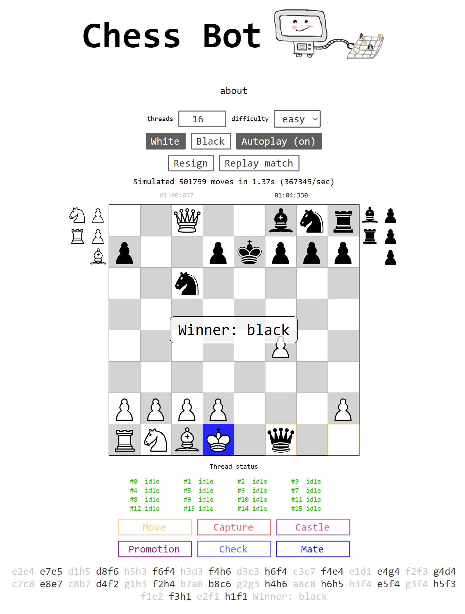

# chess-bot

## description
A chess engine & UI written in JavaScript.

Note: this engine is not bugless

## How to use
Download the files and open index.html with any modern browser.

## How it works
The chess engine explores all possible moves 4/5 levels deep. 
every move is valued based on:
- captures
- piece square table
- state of the board (check, mate, stalemate)
- pawns, knights and bishops get boosted points early game to encourage the use of them
- how close pieces are together to encourage spread

the tree is then traversed, the highest value (supposed best move) of each branch are subtracted, leaving one value for each of the original moves.
the highest value left will be the move that is played.  
Tweak the scores in ``algorithm_points.js``

## TODO
- stalemate sometimes does not show winner message
- en passant
- promotions visually stay pawns when replaying the match
- proper chess notation
- use nodes instead of weird array tree
- have the bot resign in some special cases

## future features
- improve end game
- opening book